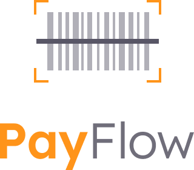

<p align="center">
  
</p>

## About 📖

A project developed during Rocketseat's Next Level Week which is a Flutter app to read boleto's barcode (a brazilian payment method) using camera or directly from an image using Google Machine Learning.

<p align="center">
    
</p>

## Libraries 📚

- Google Sign-In
- Google Machine Learning
- Firebase

## Layout 🎨

The original layout can be found [here](https://www.figma.com/file/kLK7FYnWKMoN68sQXcSniu/PayFlow).

## How to run 🏃‍♂️

Download this repository and then run:

```bash
flutter pub get
```

```bash
flutter run
```
